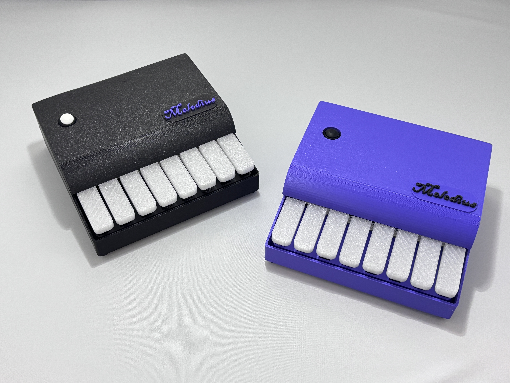
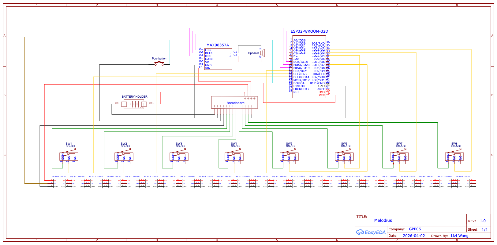
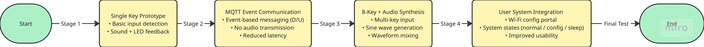
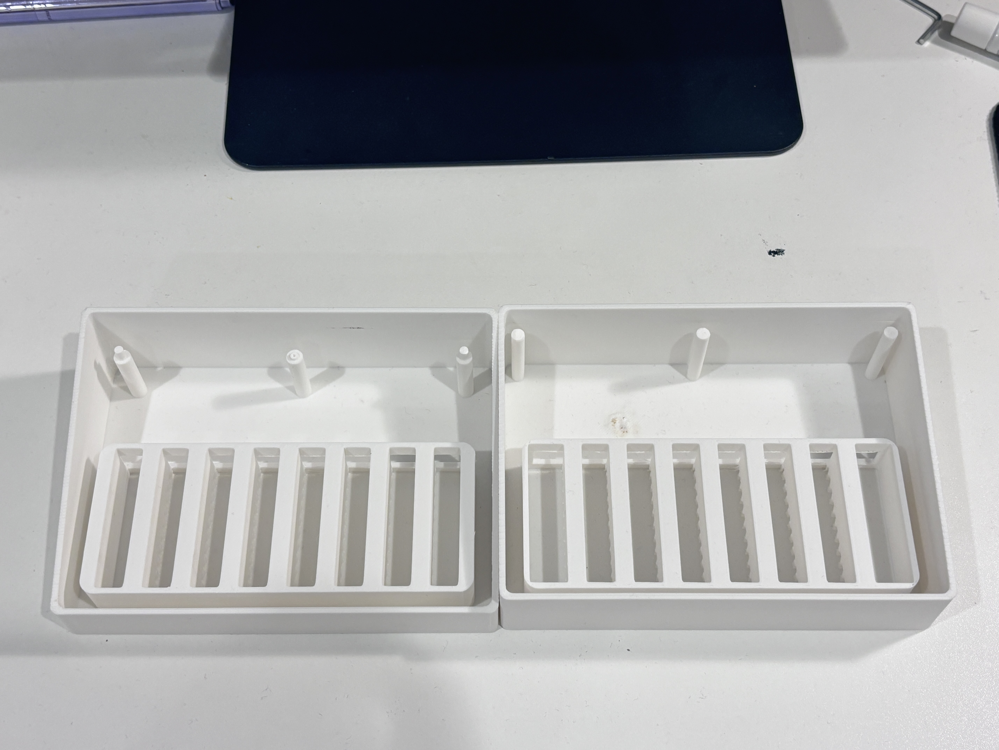
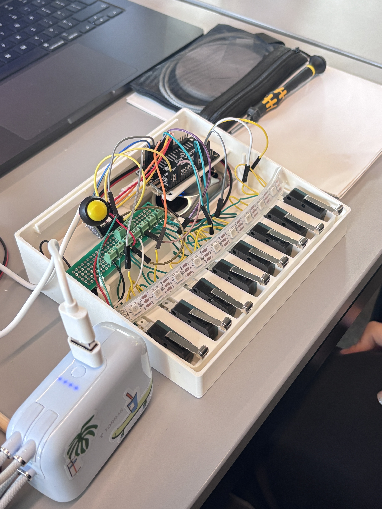
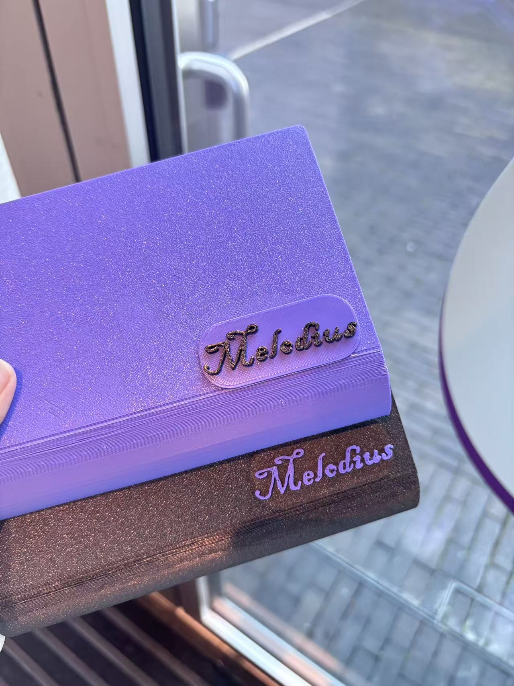
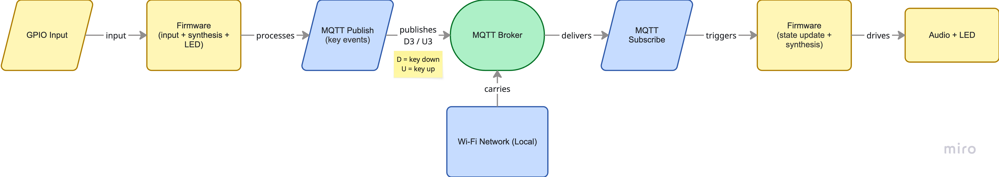

# MelodiUS

## Twin Piano Experience: An IoT-Connected Musical Instrument

**CASA0021: Group Prototype + Pitch**  
**Connected Environments - Group 6**  
**University College London (CASA) | 2025-2026**

| Team Member | Role |
|---|---|
| Madina Diallo | Project Manager |
| Xintong Shao | Enclosure Design and Aesthetics |
| Lizi Wang | Hardware & Software Developer |
| Ananya Jagadeesh Kedlaya | Software & Connectivity Lead |
| All Team Members | User Testing |

**GitHub repository:** <https://github.com/Madina1219/GPP-MelodiUS>  
**Word count:** approximately 2,000 words, excluding cover page, in-text citations and reference list  
**AI use statement:** AI tools were used to support structural review and refinement of phrasing. All technical content, design decisions, code, and analysis are the original work of the team.

---

## Abstract

MelodiUS is a pair of IoT-connected mini pianos designed to enable synchronised musical interaction between two users across any physical distance. When a key is pressed on Piano A, the corresponding key on Piano B lights up via LED feedback and plays the same note through I2S audio output, creating a mirrored experience in near real time. Communication is handled through MQTT over a local Wi-Fi network, with solenoid-based mechanical actuation identified as a future development path. This report documents the design rationale, technical development, iterative prototyping, and the broader Connected Environments context of the project, and outlines opportunities for further work.

*Figure 1: The two finished MelodiUS units - a paired connected musical instrument.*

---

## Table of Contents

- [1. Problem Identification and Motivation](#1-problem-identification-and-motivation)
  - [1.1 The Problem: Distance and Musical Connection](#11-the-problem-distance-and-musical-connection)
  - [1.2 Target Users and Scenarios](#12-target-users-and-scenarios)
  - [1.3 Context Within Connected Environments Research](#13-context-within-connected-environments-research)
- [2. Development of the Prototype and Design Iterations](#2-development-of-the-prototype-and-design-iterations)
  - [2.1 Initial Concept and Design Brief](#21-initial-concept-and-design-brief)
  - [2.2 Hardware Architecture](#22-hardware-architecture)
  - [2.3 Firmware Development](#23-firmware-development)
  - [2.4 Enclosure Design and Iterations](#24-enclosure-design-and-iterations)
  - [2.5 Connectivity and Software Stack](#25-connectivity-and-software-stack)
  - [2.6 User Testing and Evaluation](#26-user-testing-and-evaluation)
- [3. Production Cost and Sustainability](#3-production-cost-and-sustainability)
- [4. Future Improvements](#4-future-improvements)
- [5. Conclusion](#5-conclusion)
- [6. References](#6-references)

---

## 1. Problem Identification and Motivation

### 1.1 The Problem: Distance and Musical Connection

Music has long served as one of the most powerful vehicles for human connection. Yet remote work, long-distance relationships, and geographically distributed families mean that shared musical moments, playing together, learning together, or simply being present in the same musical space, are increasingly difficult to achieve. Existing solutions fall short. Video calls introduce audio-visual latency that makes synchronised playing practically impossible, while online music collaboration tools remain largely screen-based and disembodied, lacking the tactile presence of a shared instrument.

MelodiUS addresses this gap directly by exploring how two people, regardless of physical distance, can share the experience of playing an instrument together with genuine physical feedback and minimal latency, without requiring specialist audio infrastructure. The proposed answer is a pair of IoT-connected physical piano units that mirror key presses, LED responses, and, in future iterations, mechanical actuation in near real time using the MQTT messaging protocol over standard Wi-Fi.

### 1.2 Target Users and Scenarios

MelodiUS is designed for four user groups. First, distant families, for example, a grandparent playing a lullaby/nursery rhyme in Manchester while their grandchild hears every key press live in Paris. Second, couples in long-distance relationships who wish to share a nightly duet. Third, friends who grew up playing together but now live in different cities. Fourth, piano teachers and students, where a tutor in London can demonstrate fingering on a student's piano in Liverpool in real time, going beyond what screen sharing alone offers.

A central design decision was approachability. The pianos are compact, 3D-printed, and require no specialist technical knowledge: the user powers on the unit, connects to Wi-Fi through a captive web portal, and the two devices synchronise automatically through a shared MQTT broker. This deliberate simplicity lowers the barrier to entry while demonstrating sophisticated IoT connectivity underneath.

### 1.3 Context Within Connected Environments Research

MelodiUS sits within a rich lineage of research at the intersection of the Internet of Things, tangible computing, and human-computer interaction. Ishii and Ullmer (1997, pp. 234–241) argued that embedding computation in everyday objects produces more intuitive, embodied interaction; MelodiUS operationalises this principle directly, with the keys forming the interface and the LEDs and audio output forming tangible representations of networked data.

The project also draws on the calm technology tradition (Weiser and Brown, 1996, pp. 75–85), in which connected devices communicate peripherally without demanding sustained visual attention. Light and sound function here as ambient cues of remote presence rather than as primary information channels. The use of MQTT, a lightweight publish-subscribe protocol widely adopted in IoT deployments, is consistent with established practice for constrained networks (Banks and Gupta, 2014).

The project further aligns with affective computing, where connected devices mediate emotional states across distance rather than simply transmitting data (Picard, 1997). Within the specific domain of networked music performance (Rottondi et al., 2016), MelodiUS departs from high-fidelity audio streaming by transmitting discrete key-press events instead. This deliberate simplification reduces latency and hardware requirements while preserving the essence of shared musical play, positioning the project as a consumer-oriented interpretation of research-grade network music performance.

---

## 2. Development of the Prototype and Design Iterations

### 2.1 Initial Concept and Design Brief

The project responded to the Connected Places: Connected Ambient Devices Across the Miles brief, which required two independent yet linked devices capable of communicating information in a simple, glanceable, low-effort manner. Early ideation explored environmental sensing and community-based ambient systems, but the team identified an opportunity to reinterpret ambient connectivity through emotional, human-centred interaction. Music emerged as a uniquely powerful medium: it is universal, naturally expressive, and well-suited to glanceable, low-data communication.

The original vision involved full mechanical key actuation using solenoids to physically replicate remote presses. Component lead-times and the complexity of driving eight solenoids per device within a compact, battery-powered enclosure made this infeasible within the available timeframe. The team pivoted to LED feedback paired with I2S audio output, which preserves the core ambient experience of real-time perceptible connection while ensuring technical reliability. Solenoid actuation remains a defined future enhancement. The final brief settled on three requirements: near-zero perceived latency, accessible and reproducible components, and a high-quality physical form factor.

### 2.2 Hardware Architecture

Each device is built around an ESP32 microcontroller and integrates physical input, audio output, and visual feedback into a single self-contained unit. At the input layer, eight tactile push buttons are mapped to GPIO pins and represent the notes C4 to C5. Physical buttons were chosen over capacitive or screen-based alternatives because tactile feedback is fundamental to a musical interaction and lowers the barrier for non-expert users. At the output layer, audio is generated through an I2S interface driving a MAX98357A digital amplifier and a small speaker (Integrated Espressif Systems, 2024), which replaced an earlier piezo-buzzer prototype and substantially improved tonal clarity. Visual feedback is provided by a strip of WS2812 addressable LEDs, with two LEDs allocated per key and additional LEDs reserved for system states such as Wi-Fi connectivity and configuration mode, so that the device communicates its state without needing a screen.

*Figure 2: Wiring diagram for a single MelodiUS unit, showing ESP32, MAX98357A amplifier, push buttons, and the WS2812 LED strip.*

### 2.3 Firmware Development

Firmware development was highly iterative, illustrated in Figure 3. The first stage validated end-to-end interaction using a single key, confirming that the ESP32 could produce a perceptibly immediate response from physical input through to audio and LED output. Connectivity was then introduced through MQTT (Banks and Gupta, 2014). Rather than streaming audio, the system adopted an event-based protocol in which only key-press and key-release events are transmitted; each device reconstructs the corresponding sound and light locally. This event-driven choice was critical: it reduced bandwidth, removed the need for buffering, and made latency predictable.

The system was scaled to support all eight keys, with polyphony achieved by mixing real-time sine waves on the ESP32 (Smith, 2010). Finally, usability features were layered on top: a Wi-Fi access-point and captive web portal for first-time setup, a structured set of operational states (normal, configuration, sleep), and a deep-sleep routine that significantly improved battery life. Each iteration responded to a limitation observed in the previous one, allowing hardware, communication, and user experience to evolve in parallel.

*Figure 3: Firmware evolution - from a single-key prototype, through MQTT event communication, to an eight-key polyphonic system with full user-state integration.*

### 2.4 Enclosure Design and Iterations

The enclosure was designed in Fusion 360 and 3D-printed, with three significant iterations driven by the relationships between form, manufacturability, internal layout, and usability (Weichel, Lau and Gellersen, 2013).

The first version verified the overall form, proportions, and rough internal volume. Once printed, the cavities were too tight for the wiring loom, the three top pillars intended to retain the keys were fragile and broke during installation, and the keys themselves were not properly constrained, allowing them to shift during play.

*Figure 4: First enclosure iteration. Functional as a fit-check but cramped internally and structurally fragile around the key-retention pillars.*

The second version addressed these issues directly: internal volume was increased, the support pillars were widened, and dedicated holders were modelled for the ESP32 board, the battery, and the speaker. Each component now had a defined position, which simplified assembly and improved structural rigidity.

*Figure 5: Second enclosure iteration with widened pillars and dedicated component holders for the ESP32, battery, and speaker.*

The final version focused on material selection. The keys were changed from white PLA to transparent PETG so that the underlying WS2812 LEDs would illuminate the keys themselves, dramatically strengthening the visual feedback during play. A bespoke MelodiUS logo was designed and printed in a contrasting colour, and the enclosure was offered in coordinated black and purple finishes to give the product a recognisable identity and a more commercial finish.

*Figure 6: Final enclosure detail with custom MelodiUS logo, coordinated colourway, and matt textured finish.*

### 2.5 Connectivity and Software Stack

The system relies on a lightweight communication architecture in which two independent devices share a single MQTT broker over a local Wi-Fi network. Each key interaction is encoded as a minimal message containing the key index and a press or release flag. When a key is pressed, the device immediately produces local audio and LED feedback and simultaneously publishes the event; the other device, subscribed to the same topic, receives the message and reproduces the identical response. This event-based design avoids streaming and keeps round-trip latency low (Banks and Gupta, 2014).

The software is organised into clearly separated layers: a hardware layer for GPIO and I2S, a firmware layer for input handling, audio synthesis and LED control, a communication layer for MQTT, and a network layer for Wi-Fi management. The decoupling means that local responsiveness is not dependent on network conditions, and additional devices could in principle subscribe to the same topic without modification.

*Figure 7: System architecture - GPIO input is processed locally and published as an MQTT event, then mirrored on the receiving device to drive identical audio and LED output.*

### 2.6 User Testing and Evaluation

- User Feedback: Testers quickly understood the LED feedback without guidance, found the audio response satisfying, and praised the refined physical design.
- Limitations: Restricted eight-key range and no velocity sensitivity.
- Functional Results: All key presses correctly triggered notes and LEDs on both devices. Latency over local Wi-Fi stayed under 500 ms, with reliable MQTT delivery.
- Iterations: Resolved Wi-Fi setup, power consumption, and false-trigger issues.
- Constraints: Tested on a single network; latency assessed perceptually.
---

## 3. Production Cost and Sustainability

**Table 1: Unit cost breakdown.**

| Component | Description | Cost (£) |
|---|---|---:|
| Hardware | ESP32 · keys · speaker · amplifier · LEDs · battery · misc. | 20-26 |
| Manufacturing | 3D-printed enclosure · assembly materials | 5-7 |
| Development | Software development · testing and iteration, amortised | 15 |
| Additional | Packaging · miscellaneous costs | 4 |
| **Total per unit** |  | **44-52** |

**Table 2: Funding and launch plan.**

| Item | Detail |
|---|---|
| Early-bird price, pair | £100 - 50% launch discount |
| Full commercial price, pair | £200 |
| Suggested retail, single | £79-99 |
| Profit margin | ~45% early bird; ~40-50% full commercial |
| Crowdfunding goal | £30,000 - covers solenoid upgrade and tooling |
| Initial batch | 200-300 units |
| Launch target | June 2026 |

Sustainability was considered at two levels. The PLA and PETG enclosure parts are biodegradable or recyclable, and the design uses standard, widely available components that can be repaired or replaced individually, avoiding the throwaway pattern of many connected consumer devices. Future revisions could replace the lithium-ion battery with a USB-C powered configuration or, as discussed in Section 4, integrate a small solar panel to reduce ongoing energy demand.

---

## 4. Future Improvements

Several improvements have been identified for future iterations of MelodiUS:

- Expanding the keyboard from eight to sixteen keys would significantly increase musical expressiveness. The MQTT protocol already supports arbitrary key indices, so the work is mostly mechanical and electrical.
- Velocity sensitivity could be added by using Hall-effect sensors with variable magnet distances, with the velocity value carried as an additional byte in the MQTT payload.
- The originally planned solenoid actuation would transform the device from a visually and aurally synchronised system into a genuinely haptic one. This requires a dedicated driver board, a more robust power supply, and careful mechanical alignment, but the emotional impact of physically moving keys would substantially strengthen the product.
- A companion mobile app could provide pairing, configuration, and a record-and-replay mode for remote teaching.
- Migrating from a local broker to a cloud-hosted MQTT broker secured with TLS and per-device authentication would extend the operating range from a single Wi-Fi network to genuinely global distances.
- Mechanical refinement (rubberised key dampers to soften the click) and energy refinement (a solar-charged battery option) would further improve the experience and sustainability profile of the product.
A couple of small things to double-check when you paste it in:

---

## 5. Conclusion

MelodiUS demonstrates that ambient, emotionally meaningful connection between distant people can be delivered through small, accessible, well-finished hardware. By transmitting discrete events rather than audio streams, the project achieves perceptibly real-time mirroring of musical play between two ESP32-based devices using nothing more than a Wi-Fi network and an MQTT broker. The iterative development process, moving from a single-key proof of concept, through firmware scaling and three enclosure revisions, to a finished pair of branded units, produced a prototype that is reliable, reproducible, and ready for further development. While limitations remain in keyboard range, expressive nuance, and operating range, each is addressed by a clearly scoped path of future work. The result is a connected musical instrument that treats distance not as an obstacle to be overcome with higher bandwidth, but as a context in which simple, well-designed signals can carry presence, intention, and shared joy.

---

## 6. References

- Banks, A. and Gupta, R. (2014) *MQTT Version 3.1.1*. OASIS Standard. Available at: <https://www.oasis-open.org/standard/mqttv3-1-1/> (Accessed: 15 April 2026).
- Espressif Systems (2024) *ESP32 Technical Reference Manual: Inter-IC Sound (I2S)*. Available at: <https://docs.espressif.com/projects/esp-idf/en/release-v4.4/esp32/api-reference/peripherals/i2s.html> (Accessed: 15 April 2026).
- HiveMQ (2023) *MQTT Essentials: A Lightweight Messaging Protocol for IoT*. Available at: <https://www.hivemq.com/mqtt-essentials/> (Accessed: 15 April 2026).
- Ishii, H. and Ullmer, B. (1997) 'Tangible bits: towards seamless interfaces between people, bits and atoms', *Proceedings of the SIGCHI Conference on Human Factors in Computing Systems*, pp. 234-241. Available at: <https://doi.org/10.1145/258549.258715>.(Accessed: 15 April 2026).
- Picard, R.W. (1997) *Affective Computing*. Cambridge, MA: MIT Press.
- Rottondi, C., Chafe, C., Allocchio, C. and Sarti, A. (2016) 'An overview on networked music performance technology', *IEEE Access*, 4, pp. 8823-8843. Available at: <https://doi.org/10.1109/ACCESS.2016.2628440>.
- Smith, J.O. (2010) *Physical Audio Signal Processing*. W3K Publishing. Available at: <https://ccrma.stanford.edu/~jos/pasp/> (Accessed: 15 April 2026).
- Weichel, C., Lau, M. and Gellersen, H. (2013) 'Enclosed: A component-centric interface for designing prototype enclosures', *Proceedings of the 7th International Conference on Tangible, Embedded and Embodied Interaction*, pp. 215-218. Available at: <https://doi.org/10.1145/2460625.2460659> (Accessed: 3 April 2026).
- Weiser, M. and Brown, J.S. (1996) 'Designing calm technology', *PowerGrid Journal*, 1(1), pp. 75-85. Available at: <https://calmtech.com/papers/designing-calm-technology>.(Accessed: 4 April 2026).
